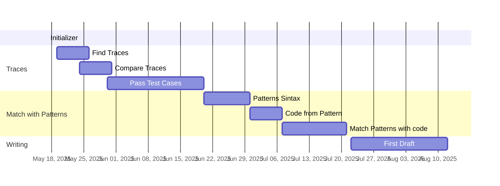

# SAME Rules Thesis Plan 2.0

## Research Questions

- What other tools are useful for this type of analysis?
- What are the advantages of using egglogs python binding?
- How to compare two .c files semantically using Egraphs?
- Can we indicate if the semantics of a piece of code can be found inside a .c file?
- What kind of sintaxis works best when writing patterns?

## Itinerary

### May / June

- Find all of the programs traces.
- Compare traces using E-graphs.
- Pass Test Cases using new model.

### July

- Start writing Patterns used for tool.
- Create comparable code from the Patterns.
- Find Patterns in Code.
- Start writing paper.

### August

- First Draft.

## Timeline

