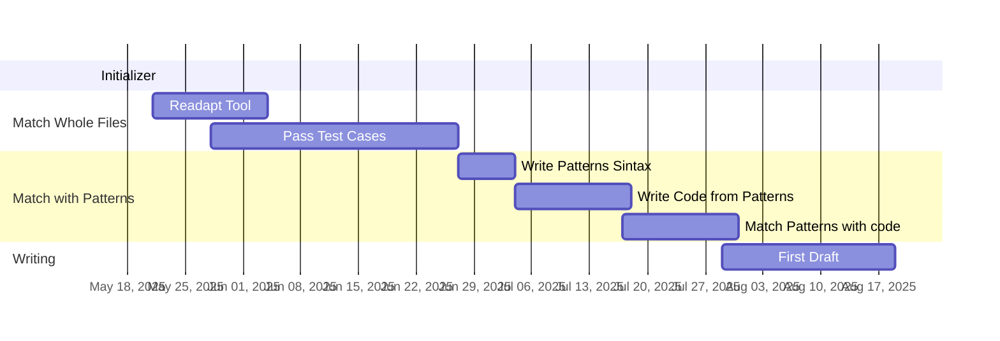

# SAME Rules Thesis Plan

## Research Questions

- What other tools are useful for this type of analysis?
- What are the advantages of using egglogs python binding?
- How to compare two .c files semantically using Egraphs?
- Can we indicate if the semantics of a piece of code can be found inside a .c file?
- What kind of sintaxis works best when writing patterns?

## Itinerary

### May / June

- Compare two .c files with the first version of the tool.
- Adapt tool to pass most Test Cases.

### July

- Finish adapting Test Cases.
- Start writing Patterns used for tool.
- Create comparable code from the Patterns.

### August

- Find Patterns in Code.
- Start writing paper.

### September

- First Draft.

## Timeline

